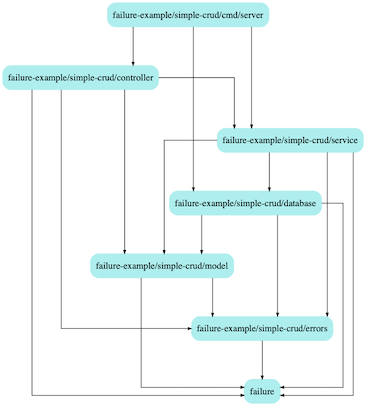

# Simple CRUD Application

Example app for handling application errors with [github.com/morikuni/failure](https://github.com/morikuni/failure).
The application is simple CRUD application which operate with key like a key-value store.
Since it's just an exmple, there are race condition problem when multiple clients request for the same key.

## Structure



Generated by [github.com/kisielk/godepgraph](https://github.com/kisielk/godepgraph).

## How to try?

### Start Server

```sh
make start
```

then, call api

```sh
curl -i "http://localhost:8080/create?key=a&value=1"
```

### Stop Server

Press `Ctrl-C`, then

```sh
make stop
```

## API

### /create

#### Request

| name | type | description |
| :- |:- |:- |
| key | string | key |
| value | int | value |

#### Response

| code | description |
| :- |:- |
| 200 | message `created` is returned |
| 400 | key or value are invalid |
| 409 | already exists |

### /read

#### Parameter

| name | type | description |
| :- |:- |:- |
| key | string | key |

#### Response

| code | description |
| :- |:- |
| 200 | value for the key is returned |
| 400 | key is invalid |
| 404 | no such key |

### /update

#### Parameter

| name | type | description |
| :- |:- |:- |
| key | string | key |
| value | int | value |

#### Response

| code | description |
| :- |:- |
| 200 | message `updated` is returned |
| 400 | key or value are invalid |
| 404 | no such key |


### /delete

#### Parameter

| name | type | description |
| :- |:- |:- |
| key | string | key |

#### Response

| code | description |
| :- |:- |
| 200 | message `deleted` is returned |
| 400 | key is invalid |
| 404 | no such key |
